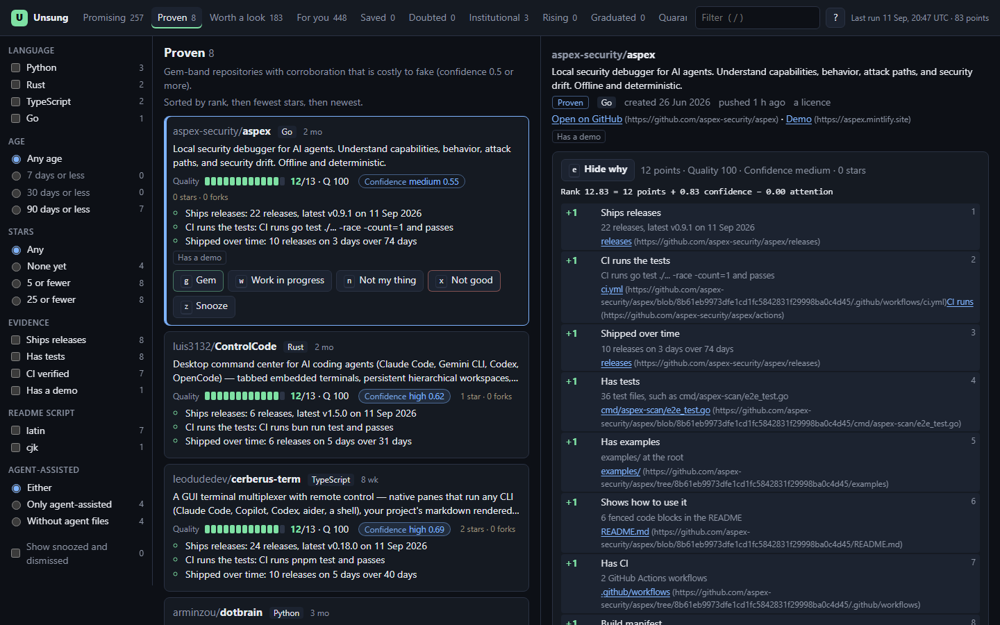
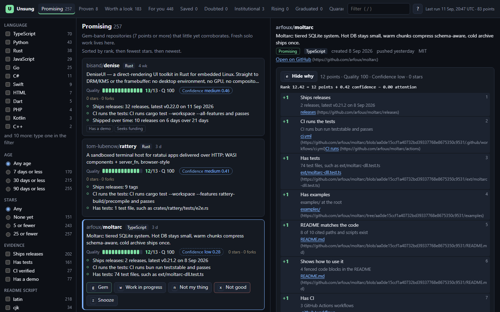

<div align="center">


# Unsung

**Good GitHub repositories that nobody has noticed yet, and the evidence that says so.**

[](https://github.com/skulitom/unsung/actions/workflows/ci.yml)


[](LICENSE)

[Website](https://skulitom.github.io/unsung/) ·
[Quick start](#quick-start) ·
[Does it work?](#does-it-work) ·
[How it decides](#how-unsung-decides) ·
[Design](DESIGN.md)



</div>

Thousands of public repositories appear on GitHub every day. A few of them are careful, working
software written by someone who has not told anyone yet. Unsung looks for those. It reads GitHub's
stream of new repositories, plus older ones that have just shipped a release, throws away the
coursework, data dumps, spam farms and empty scaffolds, and ranks what is left by what each
repository *shows*: code that exists, tests that run, versions that shipped, a README that describes
files which are really there. It never ranks by how many people have starred it.

A dark explorer on your own machine lets you go through the list from the keyboard. The
repositories you vouch for become a small static gallery, an Atom feed and a weekly digest, which
you publish yourself.

Unsung runs locally with your own GitHub token. It has no dependencies, needs no `npm install`, and
never writes anything to GitHub.

## Quick start

You need Node 20 or later and a GitHub token (see [Your GitHub token](#your-github-token)).

```bash
git clone https://github.com/skulitom/unsung
cd unsung
npm run unsung -- run     # a ten-minute, read-only scan
npm start                 # the explorer
```

Then open <http://127.0.0.1:8750>.

The first command is a quick run with a ten-minute budget. It takes a census of the repositories
created three days ago (long enough for GitHub to detect their language and for throwaway ones to
vanish), reads up to the last three hours of release and publication events from GH Archive (a
ten-minute run usually has time for one), filters the lot locally, enriches a couple of hundred of
the most promising, looks deeper at up to 50 of the top-ranked, and writes `data/index.json`. A typical quick run censused 2,505 repositories, found 940 more candidates in one
GH Archive hour, enriched 196 and deepened 50, for 83 GraphQL points and 100 REST requests: a small
fraction of an hour's allowance, well inside GitHub's secondary limits.

Runs resume. Ctrl-C finishes the request in flight, saves progress and stops; the next run carries
on where this one stopped. If GitHub asks Unsung to slow down for longer than the budget allows, the
run ends with exit code 75 and prints when to resume. `npm run unsung -- run --profile daily` does a
whole day's census without a time cap, which takes around three hours. Before your first run the
explorer shows a few example repositories, clearly marked as examples, so it is never empty.

## Does it work?

Repositories from the first two live runs were labelled blind: the labeller read each repository's
README, file tree and source through the GitHub API, and never saw its stars or Unsung's score.

| What was checked | Genuine projects |
|---|---|
| The top 25 of the first run | **22 of 25** (the two labellers agreed on 24) |
| The rest of the gem band | 9 of 10 |
| Worth a look (five or six points) | 11 of 15 |
| Low (four points or fewer), for contrast | 4 of 15 |
| The Proven lane of the second run | **8 of 8**, by both labellers |
| New Promising repositories in the second run | **12 of 12** |

The quarantine caught a real malware dropper posing as a censorship-circumvention tool, and also
hid one genuine app that commits its own APK. The labellers were AI agents, not people, so read this
as a strong indication rather than the final word. The [full write-up](research/blind-check-2026-09-11.md)
also covers what went wrong: re-uploads that reached the top, and good work the checklist missed.

## Why stars are the wrong signal

**Stars measure attention, not quality.** A repository collects stars when people happen to see it:
a launch post, a well-known author, a day on a trending page. Most good work never gets that moment,
and a star count cannot tell a finished tool with no audience from an abandoned exercise. In a
hand-labelled study of 149 repositories with few stars, the star count barely separated genuine
projects from the rest on a uniform sample (AUC 0.62), while a plain checklist of evidence did so
well (AUC 0.95).

**Agents make polish cheap.** A coding agent can produce a tidy README, a licence, badges, a CI file
and a plausible folder layout in minutes, so the surface of a repository says less than it used to.
What is still expensive to fake is what Unsung looks at hardest: tests that CI actually runs and
passes, releases shipped weeks apart, time passing between the first commit and the last push, and
other people turning up with issues.

The haystack is large. In a uniform sample of new repositories, only about one in eight was a
genuine project with substance.

## How Unsung decides

### Evidence, not applause

Each repository earns **points** from a checklist of things a reader can check, each worth one point:
a licence, a README of at least 1 KB, usage examples in it, CI, a build manifest, a lockfile (or no
dependencies at all), tests, at least 50 KB of code, a release or tag, an examples directory. Three
*proof* signals, provisional until more labels confirm them, add a point each: CI runs the tests and
passes, releases were published on different days at least a week apart, and the files and scripts
the README mentions really exist.

Penalties are for structural signs of slop, never for style: commits uploaded through the web
interface, an untouched template README, far more prose than code, committed `node_modules` or
`.env` files, an owner with hundreds of repositories, a clone command that points at someone else's
repository. Badges, emoji and hype words are not penalised; two squashed commits are not penalised.

Seven points or more is the **gem band**; five or six is **worth a look**. Some things are gates
rather than points. Lures (cracks, keygens, wallet drainers, READMEs linking to archives stored in
odd places) are **quarantined**: they are shown only as a name and a reason, never linked, never
exported and never sent to a model. Spam and commit farms are dropped. A README that tries to talk
to an AI reviewer marks the repository as doubted without changing its points.

### Three meters, never blended

- **Quality** is the points, read as an estimate: the share of genuine projects among hand-labelled
  repositories with as many points (80 % at seven points). Stars never enter it.
- **Confidence** is corroboration that is costly to fake: months between creation and the latest
  push, push days stamped by GitHub's servers, releases spread over weeks, established accounts
  opening issues, an owner with years of history before 2024, a CI run that really tests.
- **Attention** is stars and forks. It is used only to decide whether a repository is still unsung
  (25 stars at most), to spot a sudden rise, and as a small term in the rank.

The rank is `points + 1.5 × confidence − 1.5 × attention`, so corroboration and obscurity can move a
repository by a point and a half at most, and every part of it is printed:
`Rank 12.83 = 12 points + 0.83 confidence − 0.00 attention`.

### Lanes

| Lane | Rule |
|---|---|
| **Promising** | gem band, low confidence: the fresh solo projects Unsung exists for |
| **Proven** | gem band, confidence of at least 0.5 |
| **Worth a look** | five or six points |
| **Rising** | ten or more stars gained in the last four weeks |
| **Graduated** | more than 25 stars: no longer unsung |
| **Institutional** | an organisation with 100 or more public repositories, or on the allowlist |
| **Doubted** | a doubt gate, or an adverse review |
| **Quarantine** | a lure; identity and reasons only |

Every number explains itself. `npm run unsung -- explain owner/name` prints each point with its
reason and a link to its evidence at the exact commit that was scored, what would earn the next
points, and what would raise confidence. In the explorer, the Why panel also links each point to
its evidence.



## The explorer

| Key | Action |
|---|---|
| `j` / `k` | next / previous card |
| `g` | a gem: save it |
| `w` | promising work in progress (snoozed for 30 days) |
| `n` | not my thing (affects your taste only, never quality) |
| `x` then `1`–`6` | not good: slop, clone or coursework, personal, spam, data dump, near-empty |
| `z` | snooze for 30 days |
| `u` | undo |
| `p` | publish or unpublish a saved gem, with a note |
| `o` | open on GitHub |
| `e` | show or hide the reasons |
| `/`, `[`, `]`, `?` | filter, previous and next shelf, help |

Your decisions feed calibration and a gentle, bounded taste ordering in the **For you** view; taste
can reorder repositories within a band but never changes what counts as good.

## Commands

| Command | Does |
|---|---|
| `run` | discover, filter, enrich, score and index within a budget |
| `add owner/name` | score particular repositories now |
| `explain owner/name` | print a repository's points, reasons and confidence |
| `status` | recent runs, budget spent, source health |
| `recheck` | refresh existence and stars for the top of the index |
| `sample` | draw a uniform sample for blind labelling in the Calibrate tab |
| `review` | the optional model review (below) |
| `export`, `digest` | build the gallery, feeds and weekly digest (below) |
| `eval`, `calibrate` | measure the ranking against labels; refit the Quality estimate |
| `index`, `compact` | rebuild the index; apply retention and tidy `data/` |
| `serve`, `feedback import` | start the explorer; merge feedback exported from a published copy |

Run `npm run unsung -- <command> --help` for each command's flags.

## Your GitHub token

Unsung only reads public data. It takes a token from `GITHUB_TOKEN`, then `GH_TOKEN`, and otherwise
asks the GitHub CLI (`gh auth token`).

Give it a token that can do nothing else. A **fine-grained personal access token** with *Repository
access: Public repositories (read-only)* and no permissions is enough (GitHub: Settings → Developer
settings → Personal access tokens → Fine-grained tokens). Give it an expiry date. Set it without
leaving it in your shell history:

```bash
read -rs GITHUB_TOKEN && export GITHUB_TOKEN          # bash or zsh
```

```powershell
$env:GITHUB_TOKEN = Read-Host -MaskInput 'GitHub token'   # PowerShell 7
```

The token `gh auth login` creates can usually write to your repositories. If that is the one Unsung
would pick up, prefer a fine-grained token of its own, and rotate the broader one if it has ever
been printed to a terminal, a log or a chat transcript.

Unsung keeps the token in memory only. It is never written to `data/`, never put in a URL and never
passed to a child process. Every log line, error message, run manifest and cache key goes through a
redactor that removes it, along with anything else shaped like a GitHub token. The GitHub client
itself refuses to send anything but GraphQL queries and REST `GET` requests, so even a broad token
is only ever used to read.

## Optional model review

Everything works without a language model. `unsung review` asks one to look at the repositories the
checklist is least sure about (six to eight points, low confidence) and to write a one-line pitch
for the best ones. The model sees only files Unsung fetched through the API, with stars, scores and
the owner's name removed. It has no tools, and every claim it makes must quote a file exactly;
claims whose quotes cannot be found are dropped, and a verdict without at least two verified claims
has no effect. A verdict can add one point or take away two, send a repository to Doubted, or ask
that it not be promoted; it can never lift a quarantine. Verdicts are cached per commit.

Once a hundred reviewed repositories also carry your own labels, the review keeps its points only if
it measurably improves the ranking; otherwise it goes on writing pitches and nothing else.

Choose a backend with `--backend`:

- **`none`**, the default.
- **`claude-cli`** uses Claude Code, if you have it installed, and bills your Claude plan. Unsung
  starts the `claude` executable directly, never through a shell, with no tools, in an empty
  temporary directory, with the evidence on standard input and no GitHub token in its environment.

  ```bash
  npm run unsung -- review --backend claude-cli
  ```

- **`anthropic-api`** calls the Claude API through Anthropic's official SDK, which Unsung does not
  ship. Install it first:

  ```bash
  npm install @anthropic-ai/sdk
  npm run unsung -- review --backend anthropic-api
  ```

  The SDK finds your credentials itself: `ANTHROPIC_API_KEY`, `ANTHROPIC_AUTH_TOKEN`, or a profile
  saved by `ant auth login`. Unsung never logs or stores a key. `--endpoint` points it at another
  base URL; the default model is `claude-opus-5`.

  **Refusal fallbacks are on by default.** If the API's safety classifiers decline a review, the API
  re-runs it on Anthropic's recommended fallback model instead of returning nothing. Pass
  `--no-fallbacks` to turn this off. A review that is still refused is recorded as refused, is never
  retried with a reworded prompt, and counts neither for nor against the repository.

In a live test, `claude-opus-5` reviewed a 40 KB evidence pack in 36 seconds through `claude-cli`,
verified all ten of its quoted claims, and cost about 29 cents. `--max-usd` caps what one review
run may spend (three dollars by default, about ten reviews at that price).

## Publishing your picks

In the explorer, `g` saves a gem and `p` publishes it with a note. The note is the point: it is
your voice, and it appears on the gem's page and in the feeds. Then build the site:

```bash
npm run unsung -- export --site-url https://<you>.github.io/<repository>/picks/ \
  --issues-url https://github.com/<you>/<repository>/issues
npm run unsung -- digest
```

A repository is exported only if all of these hold: you saved it as a gem and published it; it is
at least seven days old; a live check just found it still public on GitHub; it has never been
quarantined; no review asked for it not to be promoted; and neither it nor its owner has opted out.
The export says which published repositories it left out and why. A page that is no longer
published is removed on the next export.

`export` writes `site/`: an index of your picks, newest first and filterable by language; one page
per gem; an Atom feed of every pick and one per language family; and `data/gallery.json`. Each gem
page shows your note, the pitch if a review wrote one (labelled as such), the reasons with links to
the evidence at the scored commit, the star count when you featured it and now, ways a reader can
help (try it, star it themselves, follow its releases, give feedback after trying it, share it,
sponsor it where the maintainer accepts sponsorship), and a line telling the maintainer how to have
it removed. The pages load no remote fonts, images or scripts.

`digest` writes Markdown and HTML for an ISO week (`--week 2026-W37`, by default the last complete
week) into `site/digest/`: the week's picks with your notes, then "four weeks on", a table of how
the picks of four weeks earlier are doing, with stars then and now, releases since, and whether they
have graduated. Paste it into a blog, a newsletter or a discussion; Unsung sends nothing anywhere.

To put your picks online, commit `site/` and push to `main`. `.github/workflows/pages.yml` deploys
the project page in `docs/` and your gallery under `/picks/` whenever either changes (with
*Settings → Pages → Source* set to *GitHub Actions*). Nothing else runs in CI: the census needs your
token and your data, and neither belongs there.

## Ethics

- **Read-only by construction.** Unsung reads; you act. It never stars, forks, comments, opens
  issues or pull requests, or emails anyone. The ways to help that it shows are for you to take, if
  you want to.
- **Nothing from a repository runs.** Unsung reads metadata and text through the GitHub API only.
  It never clones, downloads, unpacks or executes anything from a candidate, and never follows a
  URL it finds inside one. Repository text is treated as untrusted everywhere: no raw HTML, no
  remote images, and links to archives or executables are shown as text.
- **A person decides.** Nothing reaches the gallery without your explicit decision. There is no
  public score, no API and no badge to chase.
- **Maintainers can opt out.** Every gem page says how. To honour a request, add the repository or
  its owner to `data/optout.json` and export again; their pages disappear.

  ```json
  { "v": 1, "repos": ["owner/name"], "owners": ["login"] }
  ```

- **Polite to GitHub.** One token, a governor that stays well inside the published limits, and
  conditional requests wherever GitHub supports them.
- **Institutions are kept apart.** Organisations with a hundred or more public repositories get
  their own lane: their projects usually have few stars because they are niche, not because nobody
  has found them.
- The test fixtures hold short excerpts of public repositories, kept for testing only and removed on
  request (see `test/fixtures/README.md`).

## What version 0.1 does not do

- **Re-uploads can reach the top.** In the first blind check, two of the top 25 were re-uploads of
  other people's projects. Cheap provenance rules also caught genuine derivative work, so none was
  added; the optional review catches re-uploads, and content-level checks are planned.
- **It is cautious.** Many genuine repositories sit in Worth a look (11 of 15 in the blind check),
  especially small, finished tools with little metadata. That shelf and the review are where to find
  them.
- **The checklist can be dressed up.** Adding the eight cheap artefacts to every non-genuine
  repository in the labelled study dropped the checklist's AUC from 0.96 to 0.45. It is a screen
  against today's careless slop, not a fortress. The defences are the proof signals, the
  confidence the Proven lane requires, and the fact that nothing is published without you.
- **The quarantine errs on the safe side.** It hid one genuine app among three quarantined
  repositories; the weekly gate audit decides when a gate needs loosening.
- **Discovery is narrow.** It covers repositories created on one day (three days ago by default)
  and recent releases. An older repository appears when it ships a release, or when you `add` it.
- **The file store holds every candidate in memory.** Fine for quick runs; a streaming store is
  planned before the daily profile is used at scale.

## Where things live

- `data/` holds everything Unsung learns: candidates, one record per kept repository, the index,
  your feedback, review verdicts and caches. It is ignored by git; choose another place with
  `--data` or `UNSUNG_DATA`.
- `config/` holds the run profiles, governor and caps (`defaults.json`), the signal weights
  (`weights.json`), the Quality calibration (`calibration.json`) and the institutions list
  (`institutions.json`). A change to the weights or the calibration bumps its version, and
  `npm run unsung -- index --rescore` recomputes every score offline.
- `docs/` is the project page that GitHub Pages serves; `research/` holds the write-ups of the
  labelled studies.

## Development

```bash
npm test
```

Node's built-in test runner covers everything, offline: the tests never touch the network, never
start `claude` and never read `data/`. CI runs them on Node 20 and 24, on Linux and Windows.
[DESIGN.md](DESIGN.md) is the contract between the parts:

```
src/core/       pure scoring: facts, signals, gates, score, explanations (no I/O, no clock)
src/github/     the read-only client, the governor, queries
src/sources/    census, GH Archive and the uniform sampler
src/store/      data/ on disk (JSONL partitions, atomic writes)
src/pipeline/   the run: prefilter, enrich, deepen, rescore, index
src/llm/        the optional review
src/publish/    gallery, Atom feeds, digest
src/cli/        one module per command
web/, server.mjs  the local explorer (binds 127.0.0.1 only)
```

## Licence

[MIT](LICENSE)
